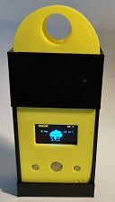
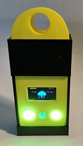

# thunderToGo
Portable Thunder Detector

A portable device to alert of nearing thunderstorms. Based on the AS3935 sensor.

The device flashes the two front LEDs with a speed proportional to the current distance of the storm and a color that fades from red to green as time without strikes passes.

